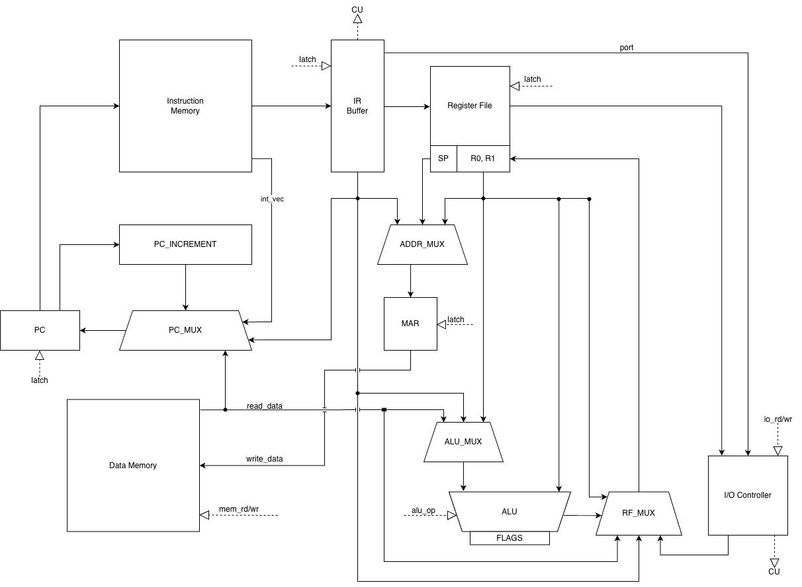
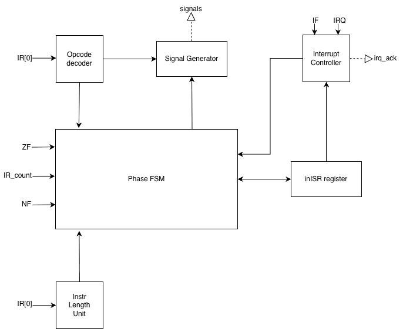

# Лабораторная работа №4. Эксперимент

**ФИО:** Столбченко Илья Викторович  
**Группа:** P3216  
**Вариант:** `lisp | cisc | harv | hw | tick | binary | trap | port | pstr | prob1`

---

## Язык программирования

Реализован упрощённый диалект Lisp. Синтаксис построен на S-выражениях (скобочная нотация).

### Синтаксис (БНФ)

```bnf
program         ::= top-form*

top-form        ::= defun-form
                  | expr

; --- Формы верхнего уровня ---
defun-form      ::= "(" "defun" identifier "(" identifier* ")" expr+ ")"

; --- Выражения ---
expr            ::= literal
                  | variable
                  | setq-form
                  | if-form
                  | loop-form
                  | begin-form
                  | arith-form
                  | cmp-form
                  | print-form
                  | io-form
                  | mem-form
                  | ctrl-form
                  | vararg-form
                  | call-form

setq-form       ::= "(" "setq"  identifier expr ")"
if-form         ::= "(" "if"    expr expr expr? ")"
loop-form       ::= "(" "loop"  "(" "while" expr ")" expr* ")"
begin-form      ::= "(" "begin" expr* ")"

; --- Арифметика ---
arith-form      ::= "(" arith-op expr expr+ ")"
arith-op        ::= "+" | "-" | "*" | "/" | "mod"

; --- Сравнение и логика ---
cmp-form        ::= "(" cmp-op  expr expr ")"
               |    "(" "not"   expr ")"
               |    "(" "and"   expr+ ")"
               |    "(" "or"    expr+ ")"
cmp-op          ::= "=" | "!=" | "<" | ">" | "<=" | ">="

; --- Ввод-вывод ---
print-form      ::= "(" "print"      expr ")"
                  | "(" "print-char" expr ")"
io-form         ::= "(" "read" ")"

; --- Работа с памятью ---
mem-form        ::= "(" "memref" expr ")"
                  | "(" "memset" expr expr ")"

; --- Управление прерываниями ---
ctrl-form       ::= "(" "ei"   ")"
                  | "(" "di"   ")"
                  | "(" "iret" ")"

; --- CISC-специфичные варарг-инструкции (только immediate-литералы) ---
vararg-form     ::= "(" "vsum"  number+ ")"
                  | "(" "vmul"  number+ ")"
                  | "(" "vsub"  number number+ ")"

; --- Вызов функции ---
call-form       ::= "(" identifier expr* ")"

; --- Атомарные значения ---
literal         ::= number | string
variable        ::= identifier

number          ::= "-"? [0-9]+
string          ::= '"' ( [^"\\] | "\\" ("n" | "t" | "\\" | '"') )* '"'
identifier      ::= [a-zA-Z_] [a-zA-Z0-9_\-+*/=<>!?]*
```

### Семантика

| Аспект | Описание |
|--------|----------|
| **Стратегия вычислений** | Аппликативный порядок: аргументы вычисляются слева направо до применения функции |
| **Области видимости** | Переменные через `setq` — глобальные. Параметры `defun` — локальные (перекрывают глобальные на время вызова) |
| **Типы** | Единственный числовой тип — знаковое 32-битное целое. Строки — Pascal-строки (`pstr`): первое слово содержит длину, далее — символы по одному на слово |
| **Рекурсия** | Поддерживается через `defun` + `call`. Параметры сохраняются на стеке на время вложенного вызова |

**Каждая форма — выражение:**

```lisp
(setq x (if (= a 0) 42 -1))       ; if возвращает значение
(setq r (loop (while (< i 3))      ; loop возвращает последний результат тела
           (setq i (+ i 1))))
(print (setq x 13))                ; setq возвращает присвоенное значение
```

### Встроенные формы

```lisp
; Управление вычислением
(setq name expr)               ; Присвоить переменной. Возвращает значение expr.
(if cond then [else])          ; Ветвление. else опущен -> возвращает 0 при ложном условии.
(loop (while cond) body...)    ; Цикл while. Возвращает последний результат body (или 0).
(begin e1 e2 ... eN)           ; Последовательность. Возвращает eN.
(defun name (args) body...)    ; Объявление функции. Тело — неявный begin.

; Работа с памятью
(memref addr)                  ; Косвенное чтение: R0 = DATA[addr].
(memset addr val)              ; Косвенная запись: DATA[addr] = val. Возвращает 0.

; Ввод-вывод
(print expr)                   ; Вывести число или строку (строка — если аргумент string-литерал).
(print-char expr)              ; Вывести байт как ASCII-символ.
(read)                         ; Прочитать байт из порта ввода (PORT_IN = 0x00).

; Прерывания
(ei)                           ; Разрешить прерывания (FLAGS.IF = 1).
(di)                           ; Запретить прерывания (FLAGS.IF = 0).
(iret)                         ; Возврат из обработчика прерывания.

; CISC варарг-инструкции (аргументы — только integer-литералы)
(vsum v1 v2 ...)               ; R0 = v1+v2+... → SUM_IMM за одну инструкцию переменной длины.
(vmul v1 v2 ...)               ; R0 = v1*v2*...
(vsub v1 v2 ...)               ; R0 = v1-v2-...
```

### Примеры программ

<details>
<summary>hello.lisp — вывод строки</summary>

```lisp
(print "Hello, World!")
```

</details>

<details>
<summary>cat.lisp — посимвольный echo через прерывания</summary>

```lisp
(setq done 0)

(defun _interrupt_handler ()
  (begin
    (setq c (read))
    (if (= c 88)
        (setq done 1)
        (print-char c))))

(ei)

(loop (while (= done 0))
  0)

(di)
```

</details>

<details>
<summary>prob1.lisp — наибольшее палиндромное произведение (Euler #4)</summary>

```lisp
; Пользователь вводит количество цифр через прерывание
(setq digits 0)
(setq done 0)

(defun _interrupt_handler ()
  (begin
    (setq c (read))
    (if (= c 10)
        (setq done 1)
        (setq digits (+ (* digits 10) (- c 48))))))

(print "Digits: ")
(ei)
(loop (while (= done 0)) 0)
(di)

; ... вычисление и вывод
```

</details>

---

## Организация памяти

Гарвардская архитектура: память инструкций и память данных — физически раздельные. Машинное слово — **32 бита**. Адресация — по словам.

### Доступные виды памяти и регистров

Программисту (на уровне ISA) доступны:

| Ресурс | Описание |
|--------|----------|
| **Память инструкций** | Только чтение во время исполнения. Содержит код программы, тела функций, ISR. Выборка по `PC`. |
| **Память данных** | Чтение и запись. Содержит строковые литералы, переменные, временные ячейки компилятора, стек. Доступ через `MAR`. |
| **R0** | Регистр общего назначения. Используется как аккумулятор и регистр возврата из функций. |
| **R1** | Регистр общего назначения. Используется компилятором как временный при косвенной адресации. |
| **SP** | Указатель стека. Инициализируется в `0x0F00`, растёт вниз. |
| **PC** | Счётчик команд. Управляется инструкциями перехода, `CALL`, `RET`, `IRET`. |
| **FLAGS** | Флаги: `ZF` (ноль), `NF` (знак), `IF` (разрешение прерываний). Управляются АЛУ, `EI`/`DI`. |

### Варианты адресации

| Режим | Инструкции | Пример |
|-------|-----------|--------|
| **Непосредственная** | `LOAD_IMM` | `LOAD R0, #42` — значение встроено в машинный код |
| **Прямая** | `LOAD_MEM`, `STORE_MEM`, `ADD_MEM`, `SUB_MEM`, … | `LOAD R0, [0x0400]` — адрес в операнде инструкции |
| **Косвенная регистровая** | `LOAD_IND`, `STORE_IND` | `LOAD R0, [R1]` — адрес берётся из регистра |

### Память инструкций

```
Instruction memory
+------------------------------+
| 0x0000 : JMP (word 0)        |  opcode-слово инструкции JMP
| 0x0001 : 0x0010              |  операнд JMP — адрес перехода (INSTR_PROGRAM_START)
| 0x0002 : interrupt vector 0  |  <- INSTR_INTERRUPT_VECTOR_0; хранит адрес ISR (0x0E00)
| 0x0003 : (padding)           |
|    ...                       |
| 0x000F : (padding)           |
| 0x0010 : program start       |  <- INSTR_PROGRAM_START
|          LOAD SP, #0x0F00    |
|          <main code>         |
|          HALT                |
|    ...                       |
| <addr> : defun bodies        |
|    ...                       |
| 0x0E00 : interrupt handler   |  <- INSTR_INTERRUPT_HANDLER_BASE
|          <ISR code>          |
|          IRET                |
+------------------------------+
```

### Память данных

```
Data memory
+------------------------------+
| 0x0000 : str literal 1 len   |  <- DATA_LITERAL_BASE = 0x0000
| 0x0001 : str literal 1 [0]   |     pstr: первое слово — длина,
|    ...                       |     далее символы по одному на слово
| 0x0400 : variable 1          |  <- DATA_VARIABLE_BASE = 0x0400
| 0x0401 : variable 2          |
|    ...                       |
| 0x0500 : temp slot 0         |  <- TEMP_BASE = 0x0500 (временные ячейки)
|    ...                       |
| 0x0580 : ISR temp slot 0     |  <- INT_TEMP_BASE = 0x0580 (временные ISR)
|    ...                       |
| 0x0600 : param slot 0        |  <- PARAM_BASE = 0x0600
|    ...                       |
|          stack (↓)           |  стек растёт вниз (к меньшим адресам)
| 0x0EFF : первый PUSH         |  = DATA_STACK_TOP - 1
| 0x0F00 : SP init (пустой)    |  <- DATA_STACK_TOP = 0x0F00
+------------------------------+
```


### Отображение программы и данных

Транслятор инициализирует обе памяти нулями и заполняет их за один проход:

**Память инструкций — порядок заполнения:**

1. `instrs[0..1]` — `JMP 0x0010` (2 слова): безусловный переход к телу программы при сбросе.
2. `instrs[0x0002]` — вектор прерывания: если в программе есть `_interrupt_handler`, сюда записывается `0x0E00`; иначе остаётся `0`.
3. `instrs[0x0003..0x000F]` — нули (padding).
4. `instrs[0x0010..]` — основной код: первая инструкция `LOAD SP, #0x0F00` (инициализация стека), затем скомпилированные формы верхнего уровня, в конце `HALT`.
5. После `HALT` — тела `defun`-функций в порядке их объявления, каждая завершается `RET`.
6. `instrs[0x0E00..]` — обработчик прерывания `_interrupt_handler` (если есть): позиция зафиксирована `INSTR_INTERRUPT_HANDLER_BASE`; перед его записью массив дополняется нулями до адреса `0x0E00`, завершается `IRET`.

Все метки переходов (`JMP`/`JZ`/`CALL` с нулевым операндом) разрешаются патчингом после полной генерации кода.

**Память данных — порядок выделения:**

| Зона | Диапазон | Как выделяется |
|------|----------|----------------|
| Строковые литералы | от `0x0000` вверх | `store_string`: длина + символы (1 слово/символ, pstr); одинаковые строки дедуплицируются |
| Глобальные переменные | от `0x0400` вверх | `get_var_addr`: каждое уникальное имя получает следующий свободный адрес |
| Временные ячейки (main) | от `0x0500` вверх | `alloc_temp`/`free_temp`: стек временных адресов во время генерации выражений |
| Временные ячейки (ISR) | от `0x0580` вверх | те же механизмы, но `current_temp_base` переключается на `INT_TEMP_BASE` при компиляции `_interrupt_handler` |
| Слоты параметров | от `0x0600` вверх | `alloc_param`: каждой функции выделяется N последовательных слов |
| Стек | от `0x0EFF` вниз | SP инициализируется в `0x0F00`; `PUSH` делает `SP--; DATA[SP] = val` |

---

## Система команд

### Особенности процессора

- **Типы данных:** единственный числовой тип — знаковое 32-битное целое (`to_signed32`/`to_unsigned32`). Символы — 8-битный ASCII в младшем байте 32-битного слова. Строки — Pascal-строки (pstr): первое слово — длина, далее N слов с кодами символов.
- **Регистры и флаги:** `R0` (аккумулятор, регистр возврата), `R1` (временный), `SP` (стек, растёт вниз от `0x0F00`), `PC` (счётчик команд), `MAR` (адресный регистр памяти данных — выставляется перед каждым чтением/записью). Флаги в `FLAGS`: `ZF` (результат == 0), `NF` (результат < 0), `IF` (разрешение прерываний).
- **Память и адресация:** Гарвардская архитектура; машинное слово — 32 бита; адресация пословная. Три режима: непосредственная (`LOAD R0, #42`), прямая (`LOAD R0, [0x0400]`), косвенная регистровая (`LOAD R0, [R1]`). Память данных доступна только через MAR (`signal_data_read`/`signal_data_write`).
- **Ввод-вывод:** port-mapped. Порт `0x00` — ввод (`IN`); порт `0x01` — вывод (`OUT`, записывает `value & 0xFF` как ASCII-символ). Инструкция `IN` очищает флаг `irq_pending` контроллера ввода-вывода.
- **Поток управления:** последовательное выполнение (PC инкрементируется при каждой выборке слова). Безусловные и условные переходы: `JMP`/`JZ`/`JNZ`/`JN`/`JP`. Подпрограммы: `CALL` сохраняет PC на стек, `RET` восстанавливает его.
- **Прерывания (trap):** IRQ поднимается контроллером при поступлении символа. Условие принятия: `IRQ=1 AND IF=1 AND NOT in_interrupt`. Аппаратная секвенция (5 тактов) сохраняет на стек `R0`, `R1`, `current_instr_pc`, `FLAGS`, затем сбрасывает `IF` и загружает PC из вектора `[0x0002]`. Сохраняется именно `current_instr_pc` — адрес **начала** прерванной инструкции, поэтому после `IRET` она **перезапускается**. Вложенные прерывания невозможны: `IF=0` на всё время ISR.
- **CISC:** инструкции переменной длины (1 или 2 слова; варарг — N+1 слов); арифметические операции работают с регистром и ячейкой памяти за одну инструкцию (`ADD R0, [addr]`); варарг-инструкции `SUM_IMM`/`VMUL_IMM`/`VSUB_IMM` принимают произвольное число immediate-операндов.

### Формат машинного слова

Машинное слово — 32 бита; инструкция занимает 1, 2 или N+1 слов. Первое слово (`word0`) всегда имеет фиксированный формат (`encode_word0` в `isa.py`):

```
 31      24 23   20 19   16 15      8 7       0
┌──────────┬───────┬───────┬─────────┬─────────┐
│  Opcode  │  dst  │  src  │  mode   │ (резерв)│
│  8 бит   │ 4 бит │ 4 бит │  8 бит  │  8 бит  │
└──────────┴───────┴───────┴─────────┴─────────┘
```

**Поля word0:**

| Поле | Биты | Значение |
|------|:----:|---------|
| `opcode` | 31–24 | Код операции (см. таблицу) |
| `dst` | 23–20 | Регистр-назначение: `R0`=0, `R1`=1, `SP`=4, `PC`=5 |
| `src` | 19–16 | Регистр-источник (те же коды) |
| `mode` | 15–8 | Для варарг-инструкций — количество операндов N; для остальных — `0x00` |
| резерв | 7–0 | Всегда `0x00` |

**Структура инструкции по числу слов:**

```
1 слово  (1-словные):   [ word0 ]
2 слова  (стандартные): [ word0 ][ operand ]       operand — адрес или immediate, 32 бит
N+1 слов (варарг):      [ word0 ][ imm1 ]...[ immN ]  N закодировано в поле mode word0
```

**Примеры кодирования:**

```
LOAD R0, #255
  word0: opcode=0x11, dst=0 (R0), src=0, mode=0  →  0x11000000
  word1: 0x000000FF
  итого: 11000000 000000FF

ADD R0, [0x0401]
  word0: opcode=0x20, dst=0 (R0), src=0, mode=0  →  0x20000000
  word1: 0x00000401
  итого: 20000000 00000401

SUM R0, n=3; 10, 20, 30
  word0: opcode=0x80, dst=0 (R0), mode=3          →  0x80000300
  word1: 0x0000000A  (10)
  word2: 0x00000014  (20)
  word3: 0x0000001E  (30)
  итого: 80000300 0000000A 00000014 0000001E
```

### Таблица инструкций

| Опкод | Мнемоника | Слов | Тактов | Действие |
|:-----:|:----------|:----:|:------:|:---------|
| `0x00` | `NOP` | 1 | **2** | нет операции |
| `0x01` | `HALT` | 1 | **2** | остановить тактовый генератор |
| `0x10` | `LOAD dst, [addr]` | 2 | **3** | `dst = DATA[addr]` |
| `0x11` | `LOAD dst, #imm` | 2 | **3** | `dst = imm` (знаковое расширение 32 бит) |
| `0x12` | `STORE [addr], src` | 2 | **3** | `DATA[addr] = src` |
| `0x13` | `MOVE dst, src` | 1 | **2** | `dst = src` |
| `0x14` | `LOAD dst, [src]` | 1 | **2** | `dst = DATA[src]` (косвенная) |
| `0x15` | `STORE [dst], src` | 1 | **2** | `DATA[dst] = src` (косвенная) |
| `0x16` | `ADD dst, src` | 1 | **2** | `dst = dst + src`; обновляет ZF, NF |
| `0x20` | `ADD dst, [addr]` | 2 | **3** | `dst = dst + DATA[addr]`; ZF, NF |
| `0x21` | `ADD dst, #imm` | 2 | **3** | `dst = dst + imm`; ZF, NF |
| `0x22` | `SUB dst, [addr]` | 2 | **3** | `dst = dst - DATA[addr]`; ZF, NF |
| `0x23` | `SUB dst, #imm` | 2 | **3** | `dst = dst - imm`; ZF, NF |
| `0x24` | `MUL dst, [addr]` | 2 | **3** | `dst = dst * DATA[addr]`; ZF, NF (нижние 32 бита) |
| `0x25` | `DIV dst, [addr]` | 2 | **3** | `dst = dst / DATA[addr]` (к нулю); ZF, NF |
| `0x26` | `MOD dst, [addr]` | 2 | **3** | `dst = dst mod DATA[addr]`; ZF, NF |
| `0x27` | `CMP dst, [addr]` | 2 | **3** | `dst - DATA[addr]`; обновляет ZF, NF; dst не меняется |
| `0x28` | `CMP dst, #imm` | 2 | **3** | `dst - imm`; ZF, NF; dst не меняется |
| `0x29` | `AND dst, [addr]` | 2 | **3** | `dst = dst & DATA[addr]`; ZF, NF |
| `0x2A` | `OR dst, [addr]` | 2 | **3** | `dst = dst \| DATA[addr]`; ZF, NF |
| `0x30` | `PUSH src` | 1 | **2** | `SP--; DATA[SP] = src` |
| `0x31` | `POP dst` | 1 | **2** | `dst = DATA[SP]; SP++` |
| `0x40` | `JMP addr` | 2 | **3** | `PC = addr` |
| `0x41` | `JZ addr` | 2 | **3** | `if ZF: PC = addr` |
| `0x42` | `JNZ addr` | 2 | **3** | `if !ZF: PC = addr` |
| `0x43` | `JN addr` | 2 | **3** | `if NF: PC = addr` |
| `0x44` | `JP addr` | 2 | **3** | `if !NF: PC = addr` |
| `0x50` | `CALL addr` | 2 | **4** | `PUSH PC; PC = addr` |
| `0x51` | `RET` | 1 | **2** | `PC = POP()` |
| `0x52` | `IRET` | 1 | **5** | `FLAGS=POP(); PC=POP(); R1=POP(); R0=POP(); IF=1` |
| `0x60` | `IN dst, port` | 2 | **3** | `dst = IO[port]` |
| `0x61` | `OUT port, src` | 2 | **3** | `IO[port] = src` |
| `0x70` | `EI` | 1 | **2** | `IF = 1` |
| `0x71` | `DI` | 1 | **2** | `IF = 0` |
| `0x80` | `SUM R0, n; v1..vN` | N+1 | **N+2** | `R0 = v1+v2+...+vN`; ZF, NF |
| `0x81` | `MUL R0, n; v1..vN` | N+1 | **N+2** | `R0 = v1*v2*...vN`; ZF, NF |
| `0x82` | `SUB R0, n; v1..vN` | N+1 | **N+2** | `R0 = v1-v2-...-vN`; ZF, NF |

**Классификация:** CISC — арифметические операции работают с регистром и ячейкой памяти за одну инструкцию; переменная длина инструкций (1–256 слов для варарг); выборка производит явную смену машинного слова на каждом такте (FETCH_W0 → FETCH_NEXT × (N−1)).

---

## Транслятор

**Файл:** `lisp_cisc/compiler.py`

### Интерфейс командной строки

```bash
python -m lisp_cisc.compiler <source.lisp> [--out-dir OUT_DIR] [--name NAME]
```

| Аргумент | Описание |
|----------|----------|
| `source.lisp` | Исходный код на Lisp |
| `--out-dir` | Директория для выходных файлов (по умолчанию `out/`) |
| `--name` | Базовое имя файлов (по умолчанию — имя исходника без расширения) |

Выходные файлы:

| Файл | Описание |
|------|----------|
| `<name>.instr.bin` | Бинарная память инструкций (big-endian, 32-bit/слово) |
| `<name>.data.bin` | Бинарная память данных |
| `<name>.instr.hex` | Текстовый hex-дамп: `0x<addr> - <hex words> - <mnemonic>` |
| `<name>.data.hex` | Текстовый дамп данных (только ненулевые слова) |
| `<name>.ast` | AST программы (для отладки) |

### Этапы трансляции

```
source.lisp → parse()  →  Compiler.compile_program()  →  *.bin / *.hex
                └─ tokenize() вызывается внутри parse()
```

**1. Лексический анализ (`tokenize`):** удаляет комментарии (`;` до конца строки), обрабатывает escape-последовательности в строках (`\n`, `\t`, `\\`, `\"`), разбивает исходник на токены: `LPAREN`, `RPAREN`, `INT`, `STR`, `SYM`.

**2. Синтаксический анализ (`parse`):** рекурсивный спуск строит AST из токенов. Каждый S-expr преобразуется в типизированный датакласс (`SetqForm`, `IfForm`, `LoopForm`, `BinopForm` и т. д.).

**3. Генерация кода (`compile_program`):**

1. Если в программе есть строковые литералы — автоматически подключается `stdlib_print_pstr.lisp`.
2. Слово `0x0000` → `JMP INSTR_PROGRAM_START (0x0010)`.
3. `defun`-формы отделяются от основного кода; для каждой параметры получают адреса в `[0x0600, ...)`.
4. Основной код компилируется начиная с `0x0010`, завершается `HALT`.
5. После `HALT` компилируются тела функций.
6. Если есть функция `_interrupt_handler`: код помещается в `0x0E00`, адрес записывается в вектор `[0x0002]`.
7. Все метки переходов разрешаются патчингом (`patch_list`).

**Инвариант стека вычислений:** результат каждой формы остаётся в `R0`. При вычислении бинарной операции правый операнд временно сохраняется через `STORE_MEM [temp]`, вычисляется левый, затем выполняется `ADD_MEM [temp]` / `MUL_MEM [temp]` и т. д. — одна инструкция читает регистр и ячейку памяти (CISC).

**Компиляция `loop`:**
```
LOAD R0, #0         ; значение по умолчанию
loop_start:
  <cond>
  CMP R0, #0
  JZ  loop_end
  <body>            ; результат body -> R0
  JMP loop_start
loop_end:           ; R0 = последний результат body (или 0)
```

**Компиляция вызова функции (`compile_call`):** активные временные ячейки и текущие значения параметров сохраняются на стек; аргументы вычисляются и записываются в слоты параметров; `CALL`; результат берётся из `R0`; стек восстанавливается.

---

## Модель процессора

**Файл:** `lisp_cisc/machine.py`

### Интерфейс командной строки

```bash
python -m lisp_cisc.machine --instr <instr.bin> --data <data.bin> \
                             [--input <schedule.txt>] [--log <log.txt>] \
                             [--max-ticks N]
```

### Входные данные

| Аргумент | Обязательный | Описание |
|----------|:---:|---------|
| `--instr` | ✓ | Бинарный файл памяти инструкций (big-endian, 32-бит/слово), выход транслятора `*.instr.bin` |
| `--data` | ✓ | Бинарный файл памяти данных, выход транслятора `*.data.bin` |
| `--input` | — | Файл расписания ввода в формате `[(такт, символ), ...]`. На каждом указанном такте контроллер выставляет символ в порт `0x00` и поднимает IRQ |
| `--max-ticks` | — | Лимит тактов (по умолчанию `1 000 000`); при достижении симуляция останавливается с пометкой `LIMIT REACHED` |
| `--log` | — | Путь для сохранения тактового журнала в файл |

### Выходные данные

**Вывод программы** — символы, записанные инструкцией `OUT port=0x01`, собираются в `IOController.output_buffer` и по окончании выводятся в `stdout`:

```
--- Output (13 chars) ---
Hello, World!
--- Stats ---
Ticks: 312
Instructions: 112
```

**Тактовый журнал** (`--log`) — одна строка на такт. Содержит:
- состояние всех регистров (`R0`, `R1`, `SP`, `MAR`, `PC`) и флагов (`Z`, `N`, `I`), сигнал `IRQ`;
- фазу (`FETCH1`, `FETCH2`, `EXEC_*`, `INT_*`) и мнемонику текущей инструкции (`OP`);
- содержимое регистра инструкции (`IR`) и описание выполненного действия (`ACT`), включая события ввода-вывода.

Формат строки:
```
TICK: 0042  FETCH1   PC: 0012  OP: LOAD R0, #0x00FF  R0: 00000000  R1: 00000000  SP: 0EFF  MAR: 0000  Z: 0  N: 0  I: 1  IRQ: 0  IR: [11000000, 000000FF] | ACT: LOAD R0, #255
```

Пример записи события ввода-вывода в поле `ACT`:
```
INPUT ready: port 0x00 <- 0x68 | IN port=0x00 -> reg0=0x68
```

### DataPath




### ControlUnit




---

## Тестирование

Тестирование выполняется через golden-тесты: `source.lisp → транслятор → instr.bin + data.bin → симулятор → вывод + журнал`. Каждый `.yaml`-файл в `tests/golden/` содержит исходный код, входные данные, hex-дамп, эталонный вывод и репрезентативный журнал.

### Тестовые программы

| # | Файл | Ввод | Ожидаемый вывод | Что демонстрирует |
|:-:|:-----|:-----|:----------------|:-----------------|
| 1 | [`hello.yaml`](tests/golden/hello.yaml) | – | `Hello, World!` | вывод строки, Pascal-строки, `stdlib_print_pstr` |
| 2 | [`cat.yaml`](tests/golden/cat.yaml) | `input/cat.txt` | `hi!` | trap I/O, `_interrupt_handler`, `ei`/`di` |
| 3 | [`hello_user_name.yaml`](tests/golden/hello_user_name.yaml) | `input/hello_user_name.txt` | `What is your name?\nHello, Alice!\n` | trap I/O, динамический буфер, `memref`/`memset` |
| 4 | [`sort.yaml`](tests/golden/sort.yaml) | `input/sort.txt` | `7, 13, 25, 42, 100\n` | trap I/O + пузырьковая сортировка |
| 5 | [`double_arith.yaml`](tests/golden/double_arith.yaml) | – | значения hi/lo/carry | 64-битная арифметика через пары 32-битных слов |
| 6 | [`prob1.yaml`](tests/golden/prob1.yaml) | `input/prob1.txt` | `Digits: 3\nLargest palindrome product: 906609\n` | алгоритм по варианту (Euler #4), `palindrome?` |
| 7 | [`arith.yaml`](tests/golden/arith.yaml) | – | `70\n` | вложенные арифметические выражения, `+`, `*` |
| 8 | [`expr_demo.yaml`](tests/golden/expr_demo.yaml) | – | `yes\n42\n0\n` | каждая форма — выражение |
| 9 | [`varargs.yaml`](tests/golden/varargs.yaml) | – | результаты `vsum`/`vmul`/`vsub` | CISC варарг-инструкции `SUM_IMM`, `VMUL_IMM`, `VSUB_IMM` |
| 10 | [`factorial.yaml`](tests/golden/factorial.yaml) | – | `120\n` | рекурсивные функции, сохранение контекста при вызовах |
| 11 | [`fibonacci.yaml`](tests/golden/fibonacci.yaml) | – | `8\n` | рекурсия, возврат значений через `R0` |

### Структура golden-файла

| Поле | Описание |
|:-----|:---------|
| `source_file` | Путь к исходному `.lisp`-файлу |
| `input_file` | Путь к расписанию ввода (`null` если нет) |
| `max_ticks` | Лимит тактов |
| `out_lst` | Hex-дамп инструкций (`[.text]`) и данных (`[.data]`) |
| `out_output` | Эталонный вывод программы |
| `out_log` | Репрезентативный тактовый журнал (начало + окно вокруг IRQ + конец) |
| `stats.instr_count` | Количество выполненных инструкций |
| `stats.tick_count` | Количество тактов |

### Формат файла расписания ввода

При старте модели задаётся расписание ввода — список пар `(такт, символ)` в виде Python-литерала:

```python
[(100, 'h'), (400, 'i'), (700, '!'), (1000, 'X')]
```

- **такт** — номер такта, на котором контроллер поднимет IRQ;
- **символ** — значение, доступное в порту начиная с указанного такта.

Символ задаётся как:
- строковый литерал в одиночных кавычках: `'h'`, `'\n'`, `'\t'`
- целое число (будет преобразовано через `chr()`): `42`, `7`, `13`

Примеры файлов из проекта:

```python
# input/cat.txt
[(100, 'h'), (400, 'i'), (700, '!'), (1000, 'X')]

# input/prob1.txt  — пользователь вводит '3' + Enter
[(1500, '3'), (2000, '\n')]

# input/sort.txt  — пять чисел как байт-значения
[(2000, 42), (3500, 7), (5000, 100), (6500, 25), (8000, 13)]
```

### Запуск тестов

```bash
# Запуск всех тестов
python -m pytest -q

# Обновить golden-файлы
python -m pytest --update-golden

# Обновить конкретный тест
python -m pytest tests/test_golden.py::test_golden[hello] --update-golden
```

### Ручной запуск

```bash
# Трансляция
python -m lisp_cisc.compiler programs/hello.lisp --out-dir out --name hello

# Симуляция (без ввода)
python -m lisp_cisc.machine --instr out/hello.instr.bin --data out/hello.data.bin

# Симуляция с вводом и сохранением журнала
python -m lisp_cisc.machine --instr out/sort.instr.bin --data out/sort.data.bin \
                             --input input/sort.txt --log out/sort.log
```

### Пример использования

```
$ python -m lisp_cisc.compiler programs/hello.lisp
Translated programs/hello.lisp -> out/hello.*

$ python -m lisp_cisc.machine --instr out/hello.instr.bin --data out/hello.data.bin
--- Output (13 chars) ---
Hello, World!
--- Stats ---
Ticks: 312
Instructions: 112
```
